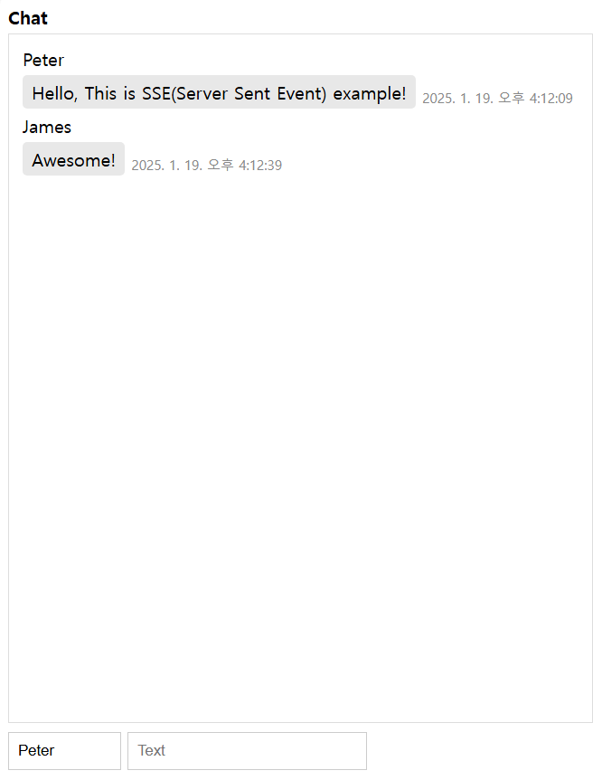

# SSE(Server-Sent Events) Chat Application Example

### 0. Example

### 1. What is this project?

This project is a simple chat application example of how to use SSE with Flask.

### 2. How to run this project?

1. Clone this repository
2. Install the dependencies
3. Run redis server
4. Run the server with `python app.py`
5. Open the browser and navigate to `http://localhost:5000/`

### 3. How it works?

1. When you join the chat, the server will send a message to the client.
2. When you send a message, the server will send message to redis server.
3. Redis broadcasts the message to all connected clients(Pub-Sub).